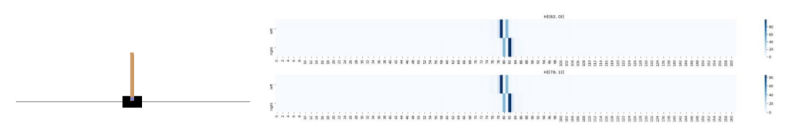
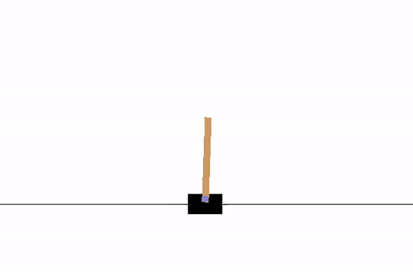
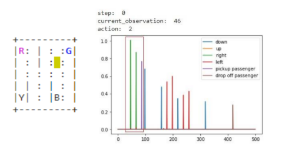
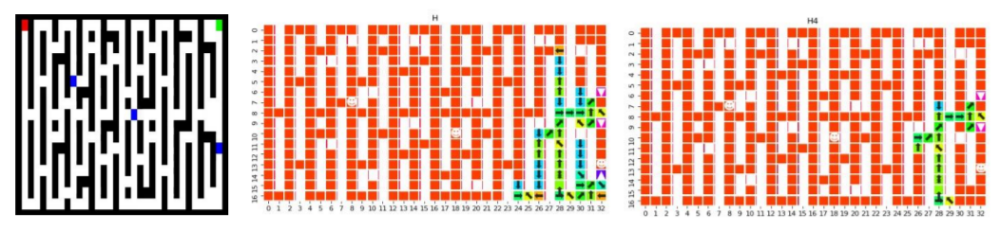
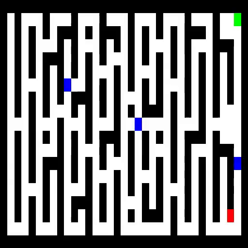

# 2021 RL Research Project

Final project for the course of Reinforcement Learning 2020/2021.

>Student: Alessandro Lambertini Mat: `1938390`;
>
>Student: Denise Landini Mat: `1938388`;

## 📝 Assignment

1.	Reimplement the Paper [Link 🔗](https://arxiv.org/abs/2011.05064) (Github page of the paper [Link 🔗](https://github.com/hmhyau/rl-intention))
    -   [RL]implementation.ipynb [Open In Collab 🔗](https://colab.research.google.com/github/lambertinialessandro/RL-FinalProject/blob/main/[RL]implementation.ipynb)
2.  Improving the paper in large and complex environments.
    -   [RL]experiments.ipynb [Open In Collab 🔗](https://colab.research.google.com/github/lambertinialessandro/RL-FinalProject/blob/main/[RL]experiments.ipynb)

## 📜 Report
-   report [Link 🔗](./RL%20project%20report.pdf)

    In this file you can read more about the code and the result of the project.

## 💯 Final score:

Score: `30L/30`

## 🙋 Info

for any doubt or clarification contact me on:

-   send me an email at: deniselandini98@gmail.com
-   send me a DM on instagram [Link 🔗](https://www.instagram.com/lambertinialessandro/)

## 🎞️ Snapshots

    </img>
     
    Carpole Enviroment with Belief Map

    </img>
     
    Video of one epoch of Carpole Enviroment

    </img>
     
    Taxi Enviroment with Belief Map

    </img>
     
    Our Enviroment with Belief Map

    </img>
     
    Video of one epoch of Our Enviroment

